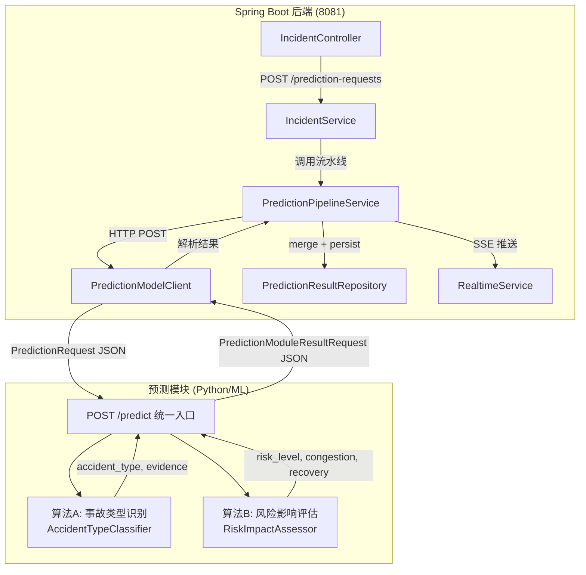
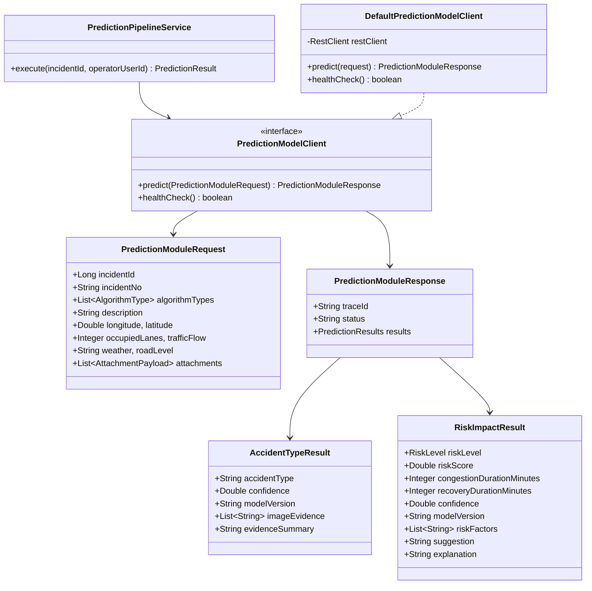
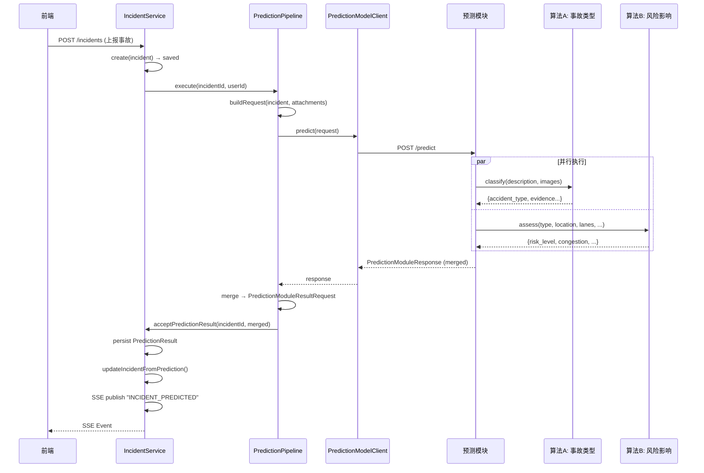

# 预测端 ↔ 后端 对接方案

> 预测端实现两个预测算法，后端通过 HTTP 调用并将结果回写数据库与实时推送。

---

## 1. 架构总览



---

## 2. 两个预测算法

| 算法 | 英文名 | 输入 | 输出 |
|---|---|---|---|
| **A — 事故类型识别** | `AccidentTypeClassifier` | 事故描述文本、现场图片路径列表 | `accident_type`、`image_evidence`、`evidence_summary`、`model_version` |
| **B — 风险影响评估** | `RiskImpactAssessor` | 事故类型、位置、占道数、车流量、天气、道路等级 | `risk_level`、`risk_score(0-100)`、`congestion_duration_minutes`、`recovery_duration_minutes`、`confidence`、`risk_factors` |

### 2.1 算法 A：事故类型识别

- **输入**：`description`（事故描述）、`attachments[].file_path`（现场照片/视频路径列表）
- **输出**：事故类型枚举值、图片证据列表、证据摘要
- **模型版本**：`accident-cls-v1`

```
事故类型枚举（中文）:
  追尾碰撞、正面碰撞、侧面碰撞、刮擦、
  单车事故、多车连环碰撞、行人事故、
  车辆起火、危险品泄漏、道路障碍物、其他
```

### 2.2 算法 B：风险影响评估

- **输入**：事故类型（算法 A 输出）、位置坐标、占道车道数、车流量、天气、道路等级
- **输出**：风险等级、风险评分(0-100)、预计拥堵分钟数、预计恢复分钟数、置信度、风险因子列表
- **模型版本**：`risk-impact-v1`

```
风险等级:
  LOW (低)       — 轻微刮擦，不影响通行
  MEDIUM (中)    — 占用 1 条车道，局部缓行
  HIGH (高)      — 占用 ≥2 条车道，明显拥堵
  CRITICAL (严重) — 多车事故/伤亡/起火/泄漏，道路封闭
```

---

## 3. API 契约

### 3.1 后端 → 预测端：提交预测请求

```
POST {prediction-module-base-url}/predict
Content-Type: application/json
```

**Request Body:**

```json
{
  "incident_id": 1001,
  "incident_no": "ACC20260709120000A1B2C3",
  "algorithm_types": ["ACCIDENT_TYPE", "RISK_IMPACT"],
  "description": "三车追尾，中间车辆受损严重",
  "longitude": 116.404,
  "latitude": 39.915,
  "occupied_lanes": 2,
  "traffic_flow": 85,
  "people_flow": 20,
  "weather": "小雨",
  "road_level": "城市主干道",
  "road_name": "北四环东路",
  "attachments": [
    {
      "attachment_id": 2001,
      "original_filename": "scene_01.jpg",
      "content_type": "image/jpeg",
      "file_size": 204800,
      "file_path": "/uploads/scene_01.jpg"
    }
  ]
}
```

### 3.2 预测端 → 后端：返回预测结果

**Response Body (同步返回):**

```json
{
  "trace_id": "pred-abc123",
  "status": "COMPLETED",
  "results": {
    "accident_type": {
      "accident_type": "追尾碰撞",
      "confidence": 0.92,
      "model_version": "accident-cls-v1",
      "image_evidence": ["图1: 三车连环追尾现场", "图2: 中间车辆引擎盖严重变形"],
      "evidence_summary": "基于2张现场照片识别为三车追尾事故，中间车辆受损程度最高"
    },
    "risk_impact": {
      "risk_level": "HIGH",
      "risk_score": 78.5,
      "congestion_duration_minutes": 45,
      "recovery_duration_minutes": 90,
      "confidence": 0.85,
      "model_version": "risk-impact-v1",
      "risk_factors": ["占用2条车道", "车流量大(85)", "小雨天气路面湿滑", "三车事故清障时间长"],
      "suggestion": "建议立即调度交警和清障车辆，安排交通疏导人员到场",
      "explanation": "该事故发生在城市主干道，占用2条车道，当前车流量较大且伴有小雨天气。三车追尾通常需要约90分钟完成现场处理和清障，预计在45分钟内拥堵将达到峰值。"
    }
  }
}
```

### 3.3 预测端 → 后端回调（异步模式）

预测端也可通过回调方式将结果写入后端：

```
POST http://backend:8081/api/v1/incidents/{incidentId}/prediction-results
Content-Type: application/json

{
  "accidentType": "追尾碰撞",
  "riskLevel": "HIGH",
  "riskScore": 78.5,
  "congestionDurationMinutes": 45,
  "recoveryDurationMinutes": 90,
  "confidence": 0.85,
  "modelVersion": "risk-impact-v1",
  "riskFactors": ["占用2条车道", "车流量大", "小雨路面湿滑"],
  "imageEvidence": ["三车连环追尾现场"],
  "evidenceSummary": "基于现场照片识别为三车追尾事故",
  "dataModuleTraceId": "pred-abc123",
  "rawResult": "{...完整JSON...}",
  "suggestion": "建议立即调度交警和清障车辆",
  "explanation": "该事故发生在城市主干道..."
}
```

---

## 4. 新增 Java 类清单

所有新增代码放在 `com.transfer.prediction` 包下，不修改现有文件：

| 类 | 路径 | 职责 |
|---|---|---|
| `PredictionAlgorithmType` | `prediction/PredictionAlgorithmType.java` | 算法枚举：ACCIDENT_TYPE / RISK_IMPACT |
| `PredictionModuleRequest` | `prediction/PredictionModuleRequest.java` | 发送给预测端的请求 DTO |
| `PredictionModuleResponse` | `prediction/PredictionModuleResponse.java` | 预测端返回的响应 DTO |
| `AccidentTypeResult` | `prediction/AccidentTypeResult.java` | 算法 A 的结果子对象 |
| `RiskImpactResult` | `prediction/RiskImpactResult.java` | 算法 B 的结果子对象 |
| `PredictionModelClient` | `prediction/PredictionModelClient.java` | 预测模块 HTTP 客户端接口 |
| `DefaultPredictionModelClient` | `prediction/DefaultPredictionModelClient.java` | 基于 RestClient 的实现 |
| `PredictionPipelineService` | `prediction/PredictionPipelineService.java` | 流水线编排：发送请求 → 解析结果 → 持久化 + SSE 推送 |

### 类关系图



---

## 5. 数据流时序



---

## 6. 集成代码

以下为 `com.transfer.prediction` 包下的核心类。详细实现见 `backend/src/main/java/com/transfer/prediction/`。

### 6.1 PredictionPipelineService（流水线编排）

```java
@Service
public class PredictionPipelineService {

    // 1. 加载事故 + 附件
    // 2. 构建 PredictionModuleRequest（含 algorithmTypes = [ACCIDENT_TYPE, RISK_IMPACT]）
    // 3. 调用 predictionModelClient.predict(request)
    // 4. 解析 PredictionModuleResponse，合并两个算法结果
    // 5. 构建 PredictionModuleResultRequest → 调用 incidentService.acceptPredictionResult()
    // 6. SSE 实时推送结果
}
```

### 6.2 DefaultPredictionModelClient（HTTP 客户端）

```java
@Component
public class DefaultPredictionModelClient implements PredictionModelClient {

    // 使用 RestClient (Spring 6.1+)
    // POST {baseUrl}/predict → PredictionModuleResponse
    // 超时: connect 5s, read 60s（模型推理可能较慢）
    // 异常处理: 网络不可达 → 返回 UNAVAILABLE 状态
}
```

---

## 7. 配置项

在 `application.properties` 中添加：

```properties
# ============================================================
# 数据预测模块对接配置
# ============================================================

# 预测模块基础 URL（必填，否则走本地降级）
app.prediction-module.base-url=http://localhost:5000

# 预测端点路径（相对 base-url）
app.prediction-module.predict-path=/predict

# 健康检查路径（可选）
app.prediction-module.health-path=/health

# HTTP 超时（毫秒）
app.prediction-module.connect-timeout=5000
app.prediction-module.read-timeout=60000

# 启用算法（默认两个都开启）
app.prediction-module.algorithms=ACCIDENT_TYPE,RISK_IMPACT

# 是否同步等待预测结果（true=同步, false=异步回调）
app.prediction-module.sync-mode=true
```

---

## 8. 降级策略

当预测模块不可用时，后端不会阻塞事故上报流程：

| 场景 | 行为 |
|---|---|
| 预测模块 URL 未配置 | `PredictionClient.predict()` 返回 `PREDICTION_MODULE_NOT_CONFIGURED`，事故正常创建 |
| 预测模块连接超时 | `ResourceAccessException` → `PREDICTION_MODULE_UNAVAILABLE`，事故保存为 REPORTED 状态 |
| 预测模块返回 4xx/5xx | `HttpStatusCodeException` → `SUBMIT_FAILED`，事故正常创建 |
| 算法 A 成功、算法 B 失败 | 部分结果写入，缺失字段为 null，记录 WARN 日志 |
| 预测端异步回調未到达 | 事故停留在 PREDICTION_REQUESTED 状态，指挥中心可手动触发重试 |

---

## 9. 预测端实现要求

预测端（Python/其他语言）需实现：

### 9.1 HTTP 服务端点

```
POST /predict
  Request:  PredictionModuleRequest (JSON)
  Response: PredictionModuleResponse (JSON)

GET /health
  Response: {"status": "ok", "algorithms": ["ACCIDENT_TYPE", "RISK_IMPACT"]}
```

### 9.2 算法 A 实现要点

- 输入文本描述 + 图片路径列表
- 可使用预训练 CV 模型（ResNet/EfficientNet）+ 文本模型（BERT）
- 输出标准事故类型枚举值（中文）
- 图片证据需附带简要文字说明

### 9.3 算法 B 实现要点

- 输入为结构化特征：事故类型、位置、占道数、车流量、天气、道路等级
- 可使用梯度提升树（XGBoost/LightGBM）或规则引擎 + 统计模型
- 风险评分 0-100，基于历史事故数据训练
- 拥堵/恢复时间使用回归模型预估

### 9.4 响应要求

- 同步模式下 60s 内返回完整结果
- 异步模式下先返回 `{"status": "PROCESSING", "trace_id": "xxx"}`，完成后回调后端

---

## 10. 测试验证

```bash
# 1. 启动预测模块（Mock）
python prediction_module/mock_server.py --port 5000

# 2. 启动后端
cd backend && mvn spring-boot:run

# 3. 上报事故 → 自动触发预测
curl -X POST http://localhost:8081/api/v1/incidents/public-report \
  -H "Content-Type: application/json" \
  -d '{
    "locationName": "北四环东路与望京西路交叉口",
    "description": "三车追尾，中间车辆受损严重，占用两条车道",
    "longitude": 116.404,
    "latitude": 39.915,
    "weather": "小雨",
    "roadLevel": "城市主干道",
    "occupiedLanes": 2,
    "trafficFlow": 85
  }'

# 4. 查询预测结果
curl http://localhost:8081/api/v1/incidents/1/prediction-result/latest
```
