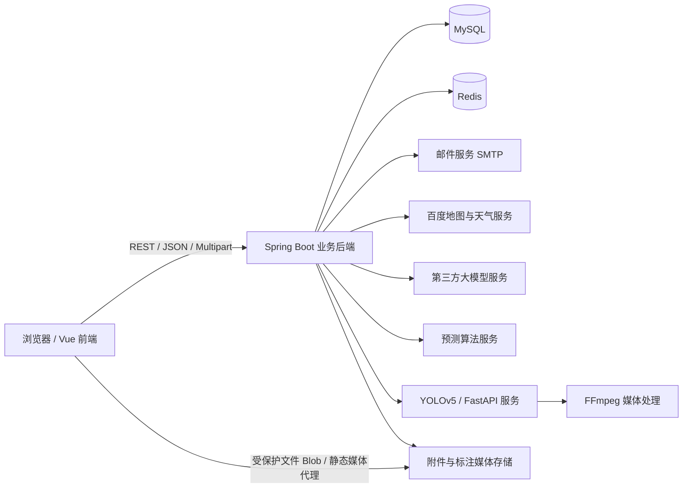
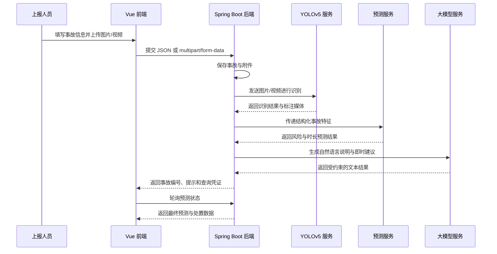

# 道路交通事故风险预估与后果预测平台

面向事故现场上报、风险研判、指挥调度、清障救援和系统管理的一体化交通事故协同处置平台。系统采用前后端分离架构，将事故信息、现场图片与视频、地图定位、天气数据、预测结果、AI 安全提示和调度任务统一接入业务流程，提升事故上报效率与处置协同能力。

> 本项目中的预测算法与 YOLOv5 识别能力由独立算法服务提供。业务后端负责接口定义、请求组装、数据传递、结果接收、状态查询、数据持久化及前端适配，不在业务工程中实现预测模型本身。

## 一、核心功能

### 1. 事故上报

- 支持事故地点、道路信息、事故类型、现场描述、人员伤亡、占用车道、交通流量和天气等信息上报。
- 支持浏览器定位、IP 定位、百度地图选点、逆地理编码及坐标转换。
- 支持图片与视频附件上传，采用 `multipart/form-data` 传输。
- 支持事故上报后查询预测处理状态，并展示事故类型、风险等级、拥堵时长、恢复时长、可信度、风险因素及自然语言说明。
- 支持事故上报后的即时安全提示和 AI 悬浮球问答。

### 2. 指挥中心

- 以沉浸式大屏展示事故列表、地图点位、风险等级、预测结果及处置状态。
- 支持查看事故详情、现场附件及 YOLO 标注后的图片和视频。
- 支持查询救援车辆 ETA、选择车辆与救援人员并生成调度任务。
- 支持查看事故关联的调度记录、处置进度与反馈信息。

### 3. 清障救援

- 支持查看个人待处理、进行中和已完成任务。
- 支持查看事故地点、任务信息、风险等级和导航信息。
- 支持更新任务状态，包括已出发、已到达、处理中和已完成。
- 支持填写现场处置反馈，形成事故处置闭环。

### 4. 用户认证与个人中心

- 支持用户注册、登录、退出、密码重置和当前用户信息查询。
- 支持滑块验证码、邮箱验证码、密码加密和 JWT 身份认证。
- 使用 Redis 保存验证码、验证状态、登录会话及 Token 状态。
- 支持个人资料查看、姓名修改和邮箱验证后修改密码。

### 5. 系统管理

- 支持用户列表查询、角色与状态修改、账号启用或禁用、用户删除。
- 支持管理员操作日志查询。
- 支持系统健康检查，展示应用、服务器、JVM、磁盘、CPU、数据库、Redis、第三方服务和业务指标状态。

### 6. AI 与媒体处理

- 接入第三方大模型服务，实现事故问答、预测结果自然语言说明和即时安全建议。
- 对 AI 输入范围、输出格式和安全建议内容进行约束，并在第三方服务异常时使用后端回退内容。
- 对接 YOLOv5 服务获取现场图片、视频的识别结果及标注文件。
- 使用 FFmpeg 对 YOLO 标注后的视频进行解析与转码处理，保证视频可正常存储、传输和播放。

## 二、系统角色

| 角色 | 角色标识 | 默认入口 | 主要权限 |
|---|---|---|---|
| 现场交警 | `POLICE` | `/police/report` | 事故上报、附件上传、AI 问答、即时提示 |
| 指挥中心 | `COMMAND` | `/command/dashboard` | 事故研判、地图监控、车辆 ETA、任务调度 |
| 清障救援 | `RESCUE` | `/rescue/tasks` | 任务接收、导航、状态更新、处置反馈 |
| 系统管理员 | `ADMIN` | `/admin/users` | 用户管理、操作日志、系统健康检查 |

所有已登录角色均可访问个人中心 `/profile`。

## 三、系统架构



### 模块边界

- **业务后端**：负责事故、用户、管理员、个人中心、调度、附件、JWT、Redis、邮件验证、AI 接口及预测接口对接。
- **预测算法服务**：负责事故风险、拥堵时长、恢复时长等预测计算。
- **YOLOv5 服务**：负责图片与视频的目标识别及标注媒体生成。
- **前端应用**：负责角色化页面、表单交互、地图展示、状态轮询、调度操作和结果可视化。

## 四、技术栈

### 前端

| 技术 | 用途 |
|---|---|
| Vue 3 | 基于 Composition API 构建页面与组件 |
| Vue Router | 页面路由、登录拦截与角色权限控制 |
| Pinia | 用户、事故和调度状态管理 |
| Element Plus | UI 组件、表单、弹窗与消息提示 |
| Axios | 统一 HTTP 请求、JWT 注入与异常处理 |
| ECharts | 指挥中心仪表盘和数据可视化 |
| SCSS | 全局样式、变量和大屏样式管理 |
| 百度地图 JavaScript API | 地图点位、选点、定位和坐标展示 |
| MockJS | 可选的前端本地模拟数据能力 |
| Vite | 前端开发构建与接口代理 |

### 后端与外部服务

| 技术 | 用途 |
|---|---|
| Spring Boot | REST API、业务逻辑与模块集成 |
| Spring Security / JWT | 登录认证、身份校验与角色权限控制 |
| MySQL | 用户、事故、预测结果、附件和调度数据持久化 |
| Redis | 验证码、滑块验证状态、Token 与缓存数据 |
| OpenAPI / Springdoc | 接口文档生成与调试 |
| SMTP 邮件服务 | 邮箱验证码发送 |
| Docker / Docker Compose | Redis、算法服务等运行环境管理 |
| Python / FastAPI | YOLOv5 识别服务及算法接口 |
| FFmpeg | 标注视频解析、转码和播放兼容处理 |
| 第三方大模型 API | AI 对话、自然语言说明和即时建议 |

## 五、前端工程结构

```text
src/
├── assets/styles/             # 全局样式、变量和指挥中心样式
├── components/                # 通用组件
│   ├── AiChatDialog.vue       # AI 对话框
│   ├── FloatingBall.vue       # AI 悬浮球
│   ├── MapCard.vue            # 百度地图组件
│   ├── PhotoUploader.vue      # 图片上传组件
│   ├── SliderCaptcha.vue      # 滑块验证码
│   ├── RiskBadge.vue          # 风险等级标签
│   ├── StatusTimeline.vue     # 事故状态时间线
│   └── CommandSemiGauge.vue   # 指挥中心半圆仪表盘
├── composables/               # 可复用组合式逻辑
├── layouts/                   # 登录布局与主业务布局
├── router/                    # 路由及角色权限守卫
├── services/
│   ├── modules/               # 事故、调度、用户、地图、天气、AI、系统接口
│   ├── mock/                  # 可选 Mock 数据
│   └── request.js             # Axios 实例与统一拦截器
├── stores/                    # Pinia 状态管理
├── utils/                     # 地图加载、定位、坐标与角色工具
├── views/
│   ├── login/                 # 登录与注册
│   ├── police/                # 现场事故上报
│   ├── command/               # 指挥中心、事故详情与调度
│   ├── rescue/                # 清障任务列表与详情
│   ├── admin/                 # 用户、日志和健康管理
│   └── Profile.vue            # 个人中心
├── App.vue
└── main.js
```

## 六、前端实现说明

### 请求与认证

前端 Axios 实例统一使用 `/api` 作为基础路径：

- 请求拦截器从 `localStorage` 读取 Token，并自动添加：

```http
Authorization: Bearer <token>
```

- 后端返回 `401 Unauthorized` 时，前端会清理本地登录信息并跳转至登录页。
- 路由守卫根据页面 `meta.roles` 校验角色权限，无权限时返回对应角色首页。
- 后端直接返回对象时，请求层会统一适配为前端使用的 `{ code, data }` 结构。

### 附件上传

事故与附件同时提交时使用 `multipart/form-data`：

| Part 名称 | 类型 | 说明 |
|---|---|---|
| `incident` | `application/json` | 事故结构化数据 |
| `photos` | 图片文件 | 公共事故上报图片，可重复提交 |
| `videos` | 视频文件 | 公共事故上报视频 |
| `files` | 文件 | 登录用户事故上报附件接口使用 |

图片、视频识别及预测可能耗时较长，前端上传请求超时时间设置为 5 分钟。

### 受保护媒体访问

原始附件接口需要 JWT，不能直接将受保护地址放入 `` 或 `<video>`。前端通过 Axios 携带认证信息读取 Blob，再转换为 `objectURL` 展示。YOLO 标注文件的绝对地址会被转换为相对路径，通过前端代理或 Spring Boot 静态资源出口统一访问。

### 地图与坐标

- 浏览器定位默认返回 WGS84 坐标。
- 平台支持 WGS84、GCJ02 与 BD09 坐标转换。
- 百度地图浏览器端配置由后端接口动态返回，避免在前端源码中硬编码密钥。

## 七、主要接口

前端统一请求前缀为 `/api`，以下路径均省略该前缀。

| 模块 | 方法与路径 | 说明 |
|---|---|---|
| 认证 | `POST /v1/auth/login` | 用户登录 |
| 认证 | `POST /v1/auth/register` | 用户注册 |
| 认证 | `POST /v1/auth/slider-captcha/challenge` | 获取滑块验证挑战 |
| 认证 | `POST /v1/auth/slider-captcha/verify` | 校验滑块验证码 |
| 认证 | `POST /v1/auth/email-code` | 发送邮箱验证码 |
| 认证 | `GET /v1/auth/me` | 获取当前用户 |
| 个人中心 | `GET /v1/profile` | 查询个人资料 |
| 个人中心 | `PUT /v1/profile/name` | 修改姓名 |
| 个人中心 | `PUT /v1/profile/password` | 修改密码 |
| 事故 | `POST /v1/incidents/public-report` | 事故上报，支持 JSON 或 Multipart |
| 事故 | `GET /v1/incidents/{id}` | 查询事故详情 |
| 事故 | `GET /v1/incidents/public/{id}/prediction-status` | 查询预测状态与结果 |
| AI | `POST /v1/report-ai/chat` | 事故场景 AI 问答 |
| AI | `GET /v1/report-ai/incidents/{id}/instant-advice` | 获取即时安全提示 |
| 指挥中心 | `GET /v1/command-center/incidents` | 获取待研判事故 |
| 指挥中心 | `GET /v1/command-center/incidents/{id}/vehicle-etas` | 查询可用车辆 ETA |
| 指挥中心 | `POST /v1/command-center/incidents/{id}/vehicle-dispatch` | 创建车辆调度 |
| 调度 | `GET /v1/dispatch-tasks` | 查询调度任务 |
| 调度 | `PUT /v1/dispatch-tasks/{id}/status` | 更新任务状态与反馈 |
| 地图 | `GET /v1/maps/client-config` | 获取地图客户端配置 |
| 地图 | `GET /v1/maps/reverse-geocode` | 逆地理编码 |
| 天气 | `GET /v1/weather/current` | 获取事故地点实时天气 |
| 管理员 | `GET /v1/admin/users` | 用户管理 |
| 管理员 | `GET /v1/admin/operation-logs` | 操作日志 |
| 管理员 | `GET /v1/admin/health` | 系统健康检查 |

完整请求参数和响应字段以 OpenAPI 文档为准。

## 八、本地运行

> 以下命令以完整工程已经包含后端 `pom.xml`、前端 `package.json`、`vite.config.*` 和入口 `index.html` 为前提。

### 1. 环境要求

- JDK：以 Spring Boot 工程配置为准
- Maven：3.8 或更高版本
- Node.js：建议使用当前 LTS 版本
- MySQL
- Redis
- Python 与 YOLOv5/FastAPI 运行环境
- FFmpeg
- Docker Desktop，可选但推荐

### 2. 配置环境变量

请使用环境变量或本地配置文件注入敏感信息，不要将真实密钥提交到 Git。

```bash
# 数据库
DB_URL=jdbc:mysql://localhost:3306/traffic_accident
DB_USERNAME=your_username
DB_PASSWORD=your_password

# Redis
REDIS_HOST=localhost
REDIS_PORT=6379
REDIS_PASSWORD=your_redis_password

# JWT
JWT_SECRET=replace_with_a_long_random_secret
JWT_EXPIRATION=7200000

# 邮件
MAIL_HOST=smtp.qq.com
MAIL_USERNAME=your_email
MAIL_PASSWORD=your_smtp_authorization_code

# 第三方服务
BAIDU_MAP_AK=your_baidu_map_key
LLM_API_KEY=your_llm_api_key
PREDICTION_BASE_URL=http://localhost:8000
```

变量名称应以实际后端配置文件为准。

### 3. 启动后端

```bash
mvn clean spring-boot:run
```

默认情况下，前端请求 `/api`，建议后端运行在：

```text
http://localhost:8080
```

### 4. 启动算法或识别服务

```bash
uvicorn main:app --host 0.0.0.0 --port 8000
```

算法服务入口、模型路径和依赖安装方式以对应算法工程说明为准。

### 5. 启动前端

```bash
npm install
npm run dev
```

Vite 开发代理示例：

```js
export default {
  server: {
    proxy: {
      '/api': {
        target: 'http://localhost:8080',
        changeOrigin: true,
      },
      '/runs': {
        target: 'http://localhost:8080',
        changeOrigin: true,
      },
    },
  },
}
```

`/runs` 应指向实际提供 YOLO 标注媒体的服务或 Spring Boot 静态资源出口。

## 九、核心业务流程



