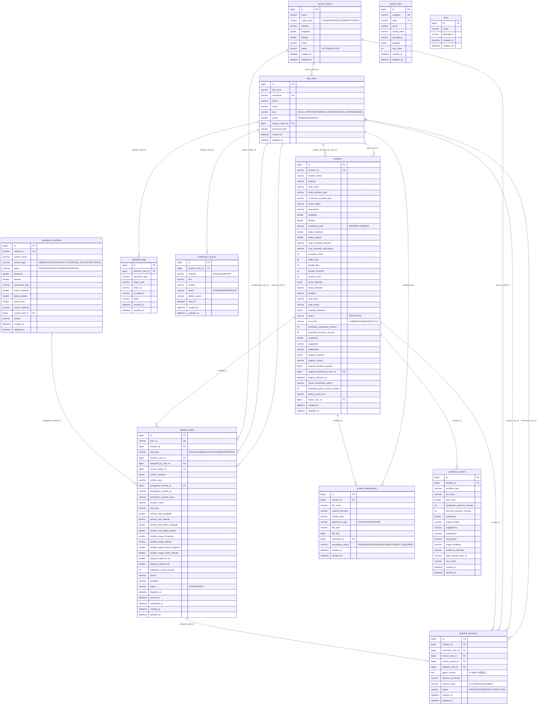

# 交通事故风险智能识别与调度系统 — ER 图

```mermaid
erDiagram
    app_users ||--o{ incidents : "report_user_id"
    app_users ||--o{ incidents : "support_decision_by_user_id"
    app_users ||--o{ dispatch_tasks : "receiver_user_id"
    app_users ||--o{ dispatch_tasks : "assigned_by_user_id"
    app_users ||--o{ dispatch_decisions : "command_user_id"
    app_users ||--o{ dispatch_decisions : "rescue_user_id"
    app_users ||--o{ incident_attachments : "uploaded_by"
    app_users ||--o{ operation_logs : "operator_user_id"
    app_users ||--o{ notification_records : "receiver_user_id"
    rescue_centers ||--o{ app_users : "rescue_center_id"
    rescue_centers ||--o{ dispatch_tasks : "rescue_center_id"
    rescue_centers ||--o{ dispatch_decisions : "rescue_center_id"

    incidents ||--o{ incident_attachments : "incident_id"
    incidents ||--o{ dispatch_tasks : "incident_id"
    incidents ||--o{ dispatch_decisions : "incident_id"
    incidents ||--o{ prediction_results : "incident_id"

    emergency_vehicles ||--o{ dispatch_tasks : "emergency_vehicle_id"
    dispatch_tasks ||--o{ dispatch_decisions : "dispatch_task_id"

    app_users {
        bigint id PK
        varchar full_name
        varchar username UK
        varchar phone
        varchar email
        varchar role "FIELD_OFFICER|COMMAND_CENTER|RESCUE_WORKER|ADMIN"
        varchar status "ENABLED|DISABLED"
        bigint rescue_center_id FK
        varchar password_hash
        datetime created_at
        datetime updated_at
    }

    incidents {
        bigint id PK
        varchar incident_no UK
        varchar location_name
        varchar address
        varchar road_name
        varchar initial_accident_type
        varchar confirmed_accident_type
        varchar scene_labels
        varchar description
        double longitude
        double latitude
        varchar coordinate_type "WGS84|GCJ02|BD09"
        double baidu_longitude
        double baidu_latitude
        varchar map_formatted_address
        varchar map_semantic_description
        int occupied_lanes
        int traffic_flow
        int people_flow
        int people_involved
        int injured_count
        tinyint injury_reported
        varchar injury_estimate
        varchar weather
        varchar road_level
        varchar road_status
        tinyint casualty_detected
        varchar status "REPORTED|..."
        varchar risk_level "LOW|MEDIUM|HIGH|CRITICAL"
        int predicted_congestion_minutes
        int predicted_recovery_minutes
        double confidence
        varchar suggestion
        varchar explanation
        tinyint support_required
        varchar support_reason
        tinyint support_decision_manual
        bigint support_decision_by_user_id FK
        datetime support_decision_at
        varchar citizen_immediate_advice
        int estimated_police_arrival_minutes
        varchar police_arrival_text
        bigint report_user_id FK
        datetime created_at
        datetime updated_at
    }

    incident_attachments {
        bigint id PK
        bigint incident_id FK
        varchar file_name
        varchar original_filename
        varchar content_type
        varchar attachment_type "PHOTO|VIDEO|OTHER"
        varchar file_path
        bigint file_size
        bigint uploaded_by FK
        varchar recognition_status "PENDING|PROCESSING|COMPLETED|NOT_REQUIRED"
        datetime created_at
        datetime updated_at
    }

    dispatch_tasks {
        bigint id PK
        varchar task_no UK
        bigint incident_id FK
        varchar task_type "RESCUE|AMBULANCE|POLICE|ENGINEERING"
        bigint receiver_user_id FK
        bigint assigned_by_user_id FK
        bigint rescue_center_id FK
        tinyint vehicle_required
        varchar vehicle_type
        bigint emergency_vehicle_id FK
        varchar emergency_vehicle_no
        varchar emergency_vehicle_name
        varchar location_name
        varchar risk_level
        double vehicle_start_longitude
        double vehicle_start_latitude
        double vehicle_start_baidu_longitude
        double vehicle_start_baidu_latitude
        double incident_target_longitude
        double incident_target_latitude
        double incident_target_baidu_longitude
        double incident_target_baidu_latitude
        double dispatch_distance_km
        double dispatch_speed_kmh
        int estimated_arrival_minutes
        varchar advice
        varchar feedback
        varchar status "DISPATCHED|..."
        datetime departed_at
        datetime arrived_at
        datetime completed_at
        datetime created_at
        datetime updated_at
    }

    emergency_vehicles {
        bigint id PK
        varchar vehicle_no UK
        varchar vehicle_name
        varchar vehicle_type "AMBULANCE|CLEARANCE_TRUCK|TOW_TRUCK|FIRE_TRUCK"
        varchar status "AVAILABLE|DISPATCHED|MAINTENANCE"
        double longitude
        double latitude
        varchar coordinate_type
        double baidu_longitude
        double baidu_latitude
        double speed_kmh
        varchar current_address
        bigint current_task_id FK
        varchar remark
        datetime created_at
        datetime updated_at
    }

    rescue_centers {
        bigint id PK
        varchar name
        varchar center_type "CLEARANCE|RESCUE|MAINTENANCE"
        varchar address
        double longitude
        double latitude
        varchar phone
        varchar status "ACTIVE|INACTIVE"
        datetime created_at
        datetime updated_at
    }

    dispatch_decisions {
        bigint id PK
        bigint incident_id FK
        bigint command_user_id FK
        bigint rescue_user_id FK
        bigint rescue_center_id FK
        bigint dispatch_task_id FK
        text agent_content "AI Agent 分析建议"
        varchar decision_summary
        varchar decision_type "AUTO|MANUAL|HYBRID"
        varchar status "DRAFT|ISSUED|EXECUTED|CLOSED"
        datetime created_at
        datetime updated_at
    }

    prediction_results {
        bigint id PK
        bigint incident_id FK
        varchar accident_type
        varchar risk_level
        double risk_score
        int congestion_duration_minutes
        int recovery_duration_minutes
        double confidence
        varchar model_version
        varchar suggestions
        varchar explanation
        varchar risk_factors
        varchar image_evidence
        varchar evidence_summary
        varchar data_module_trace_id
        varchar raw_result
        datetime created_at
        datetime updated_at
    }

    operation_logs {
        bigint id PK
        bigint operator_user_id FK
        varchar operation_type
        varchar object_type
        varchar object_id
        varchar ip_address
        varchar detail
        datetime created_at
        datetime updated_at
    }

    notification_records {
        bigint id PK
        bigint receiver_user_id FK
        varchar channel "EMAIL|SMS|PUSH"
        varchar title
        varchar content
        varchar status "PENDING|SENT|FAILED"
        varchar failure_reason
        datetime sent_at
        datetime created_at
        datetime updated_at
    }

    system_data {
        bigint id PK
        varchar category UK
        varchar code UK
        varchar name
        varchar config_value
        varchar description
        tinyint enabled
        int sort_order
        datetime created_at
        datetime updated_at
    }

    items {
        bigint id PK
        varchar name
        varchar description
        datetime created_at
        datetime updated_at
    }
```
